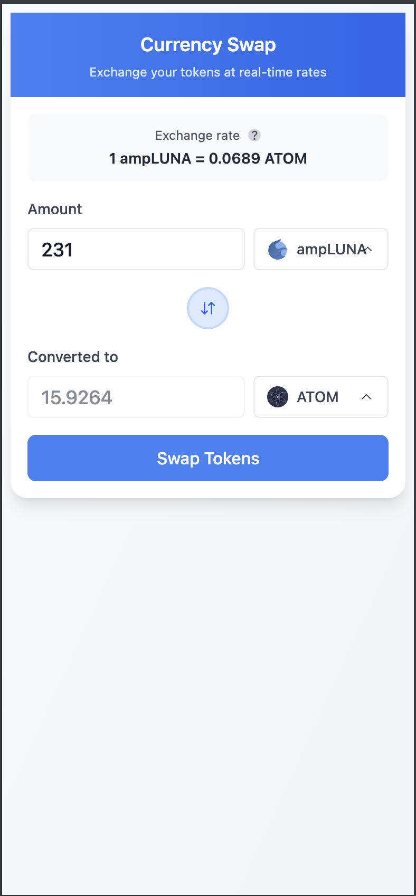
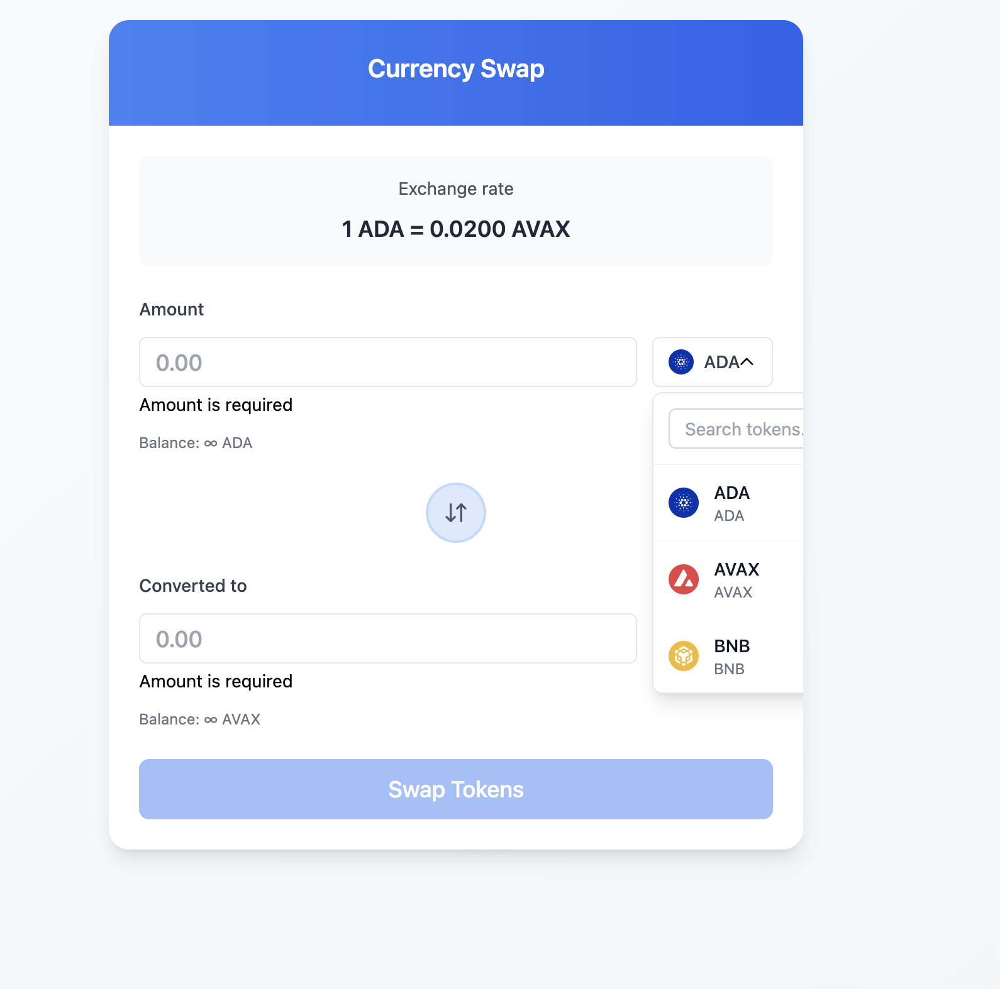

## 📸 Screenshots & Demo

### Demo Video






## Project Structure

```
fancy-form/
├── src/
│   ├── components/     # React components
│   ├── assets/         # Static assets
│   ├── App.tsx         # Main App component
│   ├── App.css         # App styles
│   ├── main.tsx        # Application entry point
│   └── index.css       # Global styles
├── public/             # Public assets
├── Dockerfile          # Docker configuration
├── docker-compose.yml  # Docker Compose configuration
├── .dockerignore       # Docker ignore file
├── package.json        # Dependencies and scripts
├── tsconfig.json       # TypeScript configuration
├── tsconfig.node.json  # Node TypeScript configuration
├── vite.config.ts      # Vite configuration
└── index.html          # HTML template

## Getting Started

### Prerequisites

- Node.js 18+ (recommended: Node.js 20+)
- Docker and Docker Compose
- npm or yarn

### Local Development

1. **Install dependencies:**
   ```bash
   npm install
   ```

2. **Start development server:**
   ```bash
   npm run dev
   ```

3. **Build for production:**
   ```bash
   npm run build
   ```

4. **Preview production build:**
   ```bash
   npm run preview
   ```

