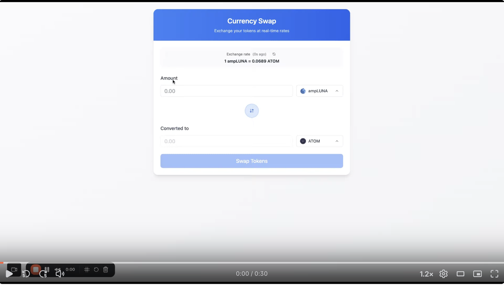
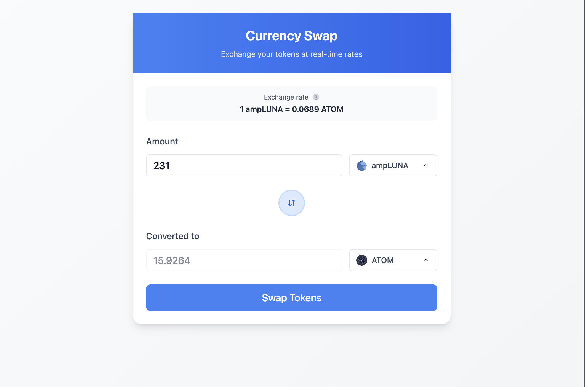
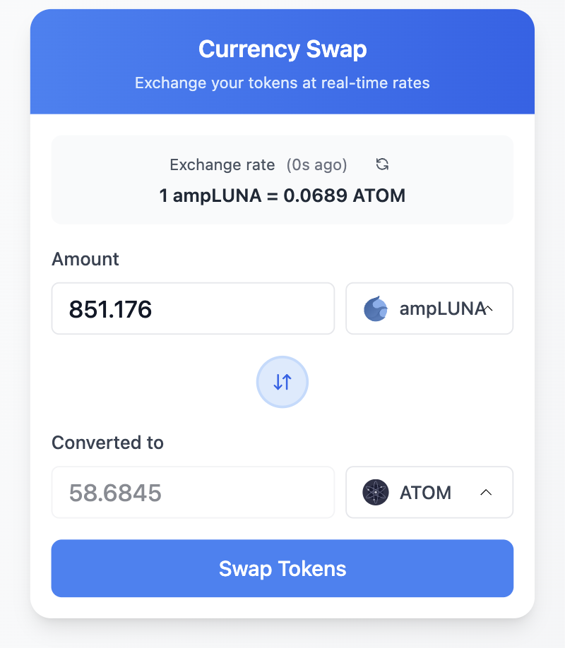

## 📸 Screenshots & Demo

### Demo Video
[](https://www.loom.com/share/8528fffe13bf40e2b8be004e247a9dd0?sid=37806596-d10e-44ba-804d-d3ab20d3be65)

### Screenshots

#### Desktop View


#### Mobile View  


## 🔄 Application Flow

### User Journey
```
┌─────────────┐    ┌─────────────┐    ┌─────────────┐    ┌─────────────┐
│   SELECT    │    │   ENTER     │    │   SWAP      │    │   SUBMIT    │
│   TOKENS    │───▶│   AMOUNT    │───▶│   TOKENS    │───▶│   FORM      │
└─────────────┘    └─────────────┘    └─────────────┘    └─────────────┘
```

### Real-time Updates
```
┌─────────────┐    ┌─────────────┐    ┌─────────────┐
│30 Second    │    │API Call     │    │Update       │
│Interval     │───▶│to API       │───▶│Prices       │
└─────────────┘    └─────────────┘    └─────────────┘
```

## ✨ Features

### 🎯 Core Functionality
- **Real-time Token Prices**: Automatic price updates every 30 seconds
- **Currency Swap Interface**: Intuitive form for token exchange
- **Live Exchange Rates**: Dynamic rate calculation and display
- **Number Formatting**: Smart comma formatting (1,000.00)
- **Float Support**: Handles decimal amounts with precision

### 🎨 User Experience
- **Mobile-First Design**: Responsive layout for all devices
- **Clean UI**: Modern card-based interface with blue theme
- **Loading States**: Smooth loading indicators
- **Error Handling**: User-friendly error messages
- **Success Feedback**: Confirmation messages for actions

### 🔧 Technical Features
- **Hot Reload**: Instant updates during development
- **Docker Support**: Containerized deployment
- **TypeScript**: Full type safety
- **Custom Hooks**: Modular logic separation
- **Path Aliases**: Clean import structure (@/components, @/hooks, etc.)

### 📱 Responsive Design
- **iPhone 14 Optimized**: Perfect mobile experience
- **Tablet Support**: Adaptive layout for larger screens
- **Desktop Ready**: Full desktop functionality
- **Fixed Width**: Consistent 552px form container

## Project Structure

```
fancy-form/
├── src/
│   ├── components/     # React components
│   ├── assets/         # Static assets
│   ├── App.tsx         # Main App component
│   ├── App.css         # App styles
│   ├── main.tsx        # Application entry point
│   └── index.css       # Global styles
├── public/             # Public assets
├── Dockerfile          # Docker configuration
├── docker-compose.yml  # Docker Compose configuration
├── .dockerignore       # Docker ignore file
├── package.json        # Dependencies and scripts
├── tsconfig.json       # TypeScript configuration
├── tsconfig.node.json  # Node TypeScript configuration
├── vite.config.ts      # Vite configuration
└── index.html          # HTML template

## Getting Started

### Prerequisites

- Node.js 18+ (recommended: Node.js 20+)
- Docker and Docker Compose
- npm or yarn

### Local Development

1. **Install dependencies:**
   ```bash
   npm install
   ```

2. **Start development server:**
   ```bash
   npm run dev
   ```

3. **Build for production:**
   ```bash
   npm run build
   ```

4. **Preview production build:**
   ```bash
   npm run preview
   ```

### 🧪 Testing

1. **Run all tests:**
   ```bash
   npm test
   ```

2. **Run tests in watch mode:**
   ```bash
   npm run test:watch
   ```

3. **Run tests with coverage:**
   ```bash
   npm run test:coverage
   ```


### 🐳 Docker Development

1. **Build and run with Docker:**
   ```bash
   docker-compose up --build
   ```

2. **Run in background:**
   ```bash
   docker-compose up -d
   ```

3. **Stop containers:**
   ```bash
   docker-compose down
   ```

4. **View logs:**
   ```bash
   docker-compose logs app
   ```

**🌐 Access the app**: http://localhost:3000

